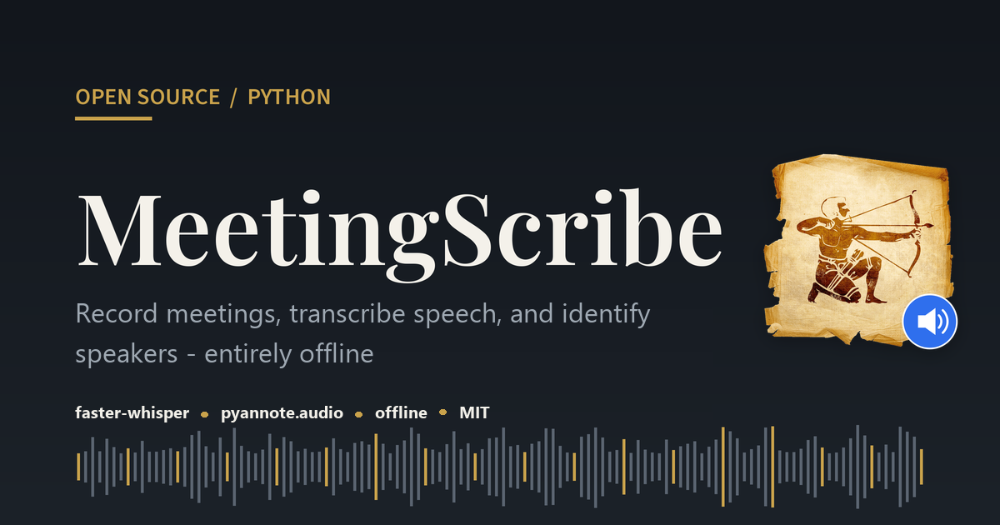

<p align="center">
  
</p>

# MeetingScribe

[](https://en.wikipedia.org/wiki/List_of_Microsoft_Windows_versions)
[](https://github.com/sergeiown/MeetingScribe/blob/main/LICENSE)
[](https://github.com/sergeiown/MeetingScribe/releases/latest)

**English** · [Українська](README.uk.md)

Local speech-to-text with speaker diarization and known-speaker recognition.
Everything runs on your own machine via [faster-whisper](https://github.com/SYSTRAN/faster-whisper)
and [pyannote.audio](https://github.com/pyannote/pyannote-audio) - no cloud APIs,
no audio ever leaves the host.

Built for meeting and conversation recordings, primarily in **Ukrainian**, with
automatic language detection (Whisper is multilingual, so other languages work too).

## How it works

1. You drop audio/video files into the `input/` folder and run the tool.
2. faster-whisper transcribes the speech.
3. pyannote `speaker-diarization-3.1` splits the audio into speaker turns.
4. Each turn is turned into a voice embedding and matched against a local
   speaker database, so known people get their real names in the transcript.
5. Unrecognized speakers are shown with sample lines; you can name them and
   optionally save their voiceprint for next time.
6. The result is written as plain text to the `output/` folder.

If no HuggingFace token is configured, diarization is unavailable and the tool
falls back to a plain transcript with timestamps.

## Features

- Fully local - runs offline once models are downloaded; no audio uploaded anywhere.
- Speaker diarization (who spoke when) via pyannote `speaker-diarization-3.1`.
- Known-speaker recognition against a local, versioned voiceprint database.
- On-the-fly enrollment: name an unknown speaker and save their voiceprint
  (`Name (v1).npy`, `Name (v2).npy`, …), with overwrite / add-version / skip prompts.
- Automatic language detection, optimized for Ukrainian (other languages are
  supported via Whisper's multilingual model).
- CPU or NVIDIA CUDA, auto-detected.
- Skips files already transcribed in `output/` (asks before overwriting), so
  re-running a batch does not redo finished work.
- Plain-text output, easy to read and diff.

## Requirements

What you need yourself:

- **Windows 10/11.** The `.bat` launchers are Windows-oriented (the Python
  scripts themselves are cross-platform).
- **An internet connection** for the first run (to fetch dependencies and models).
- **Optional: a [HuggingFace](https://huggingface.co/) account and token** to
  enable speaker diarization. Without it the tool still works as plain
  transcription. See [Configuration](#configuration-huggingface-token).

Everything else is installed automatically by `setup.bat`, you do not need to
prepare any of it:

- **Python 3.12** (only if Python is not already installed).
- **ffmpeg**.
- **Python dependencies** from `requirements.txt` (faster-whisper,
  pyannote.audio, torch, numpy, huggingface_hub, ffmpeg-python).
- The **CUDA build of torch** if an NVIDIA GPU is detected (otherwise it runs on
  CPU). Auto-detected, nothing to configure.
- The **models** (see [Models and licenses](#models-and-licenses)).

## Install

Run the one-time setup from the project folder:

```bat
setup.bat
```

It checks/installs Python, ffmpeg and the Python dependencies, detects an NVIDIA
GPU and installs the CUDA build of torch if present, prepares `config.env`,
reminds you about the HuggingFace model licenses, and downloads the models. It
ends with a summary and waits for a keypress.

To (re-)download models separately:

```bat
download_models.bat
```

`download_models.py` supports `--all` (mandatory + every optional, no prompts),
`--mandatory` (mandatory only), and an interactive default. Run
non-interactively without a flag, it behaves as `--mandatory`.

## Configuration (HuggingFace token)

Diarization uses gated pyannote models, which require a HuggingFace token with
the model licenses accepted.

1. Copy the template to create your local config:

   ```bat
   copy config.env.example config.env
   ```

   (`setup.bat` does this for you if `config.env` is missing.)

2. Get a token at <https://hf.co/settings/tokens> and put it in `config.env`:

   ```
   HF_TOKEN=hf_your_token_here
   ```

   `HF_TOKEN` can also be set as an environment variable, which takes precedence.

3. Accept the license for each gated pyannote model while logged in to
   HuggingFace:
   - <https://hf.co/pyannote/speaker-diarization-3.1>
   - <https://hf.co/pyannote/segmentation-3.0>
   - <https://hf.co/pyannote/embedding>

`config.env` is git-ignored and must never be committed with a real token.

## Usage

1. Put your audio/video files in the `input/` folder.
2. Run:

   ```bat
   run.bat
   ```

3. Pick the file(s), recognition model, language, and whether to diarize.
4. For unrecognized speakers, optionally type a name and save their voiceprint.
5. Find the transcript in `output/` (one `.txt` per input file).

## Supported input formats

`.webm` `.mp4` `.mkv` `.mov` `.avi` `.m4a` `.mp3` `.wav`

## Output format

Plain text, one block per speaker turn:

```
[Speaker name or Speaker N] mm:ss
spoken text for this turn...

[Another speaker] mm:ss
their spoken text...
```

If diarization is unavailable, the tool falls back to a continuous transcript
with periodic timestamps.

## Models and licenses

No model weights are stored in this repository. They are downloaded separately
by `download_models.py` into the local `models/` folder, and **each is covered
by its own license - not by this project's MIT license**. You are responsible
for accepting and complying with the terms of every model you download.

### Speaker diarization & recognition - pyannote (gated)

These require a HuggingFace account and accepting the conditions on each model
page (see [Configuration](#configuration-huggingface-token)):

| Model | Page | Used for |
|---|---|---|
| `pyannote/speaker-diarization-3.1` | <https://hf.co/pyannote/speaker-diarization-3.1> | Diarization pipeline |
| `pyannote/segmentation-3.0` | <https://hf.co/pyannote/segmentation-3.0> | Speech segmentation |
| `pyannote/wespeaker-voxceleb-resnet34-LM` | <https://hf.co/pyannote/wespeaker-voxceleb-resnet34-LM> | Diarization embeddings |
| `pyannote/embedding` | <https://hf.co/pyannote/embedding> | Known-speaker enrollment & matching |

### Speech recognition - Whisper (via faster-whisper)

Public repositories, downloaded under their own terms:

| Model | Page | Notes |
|---|---|---|
| `Systran/faster-whisper-large-v3-turbo` | <https://hf.co/Systran/faster-whisper-large-v3-turbo> | **Mandatory** - default model (~1.6 GB) |
| `Systran/faster-whisper-large-v3` | <https://hf.co/Systran/faster-whisper-large-v3> | **Optional** - higher accuracy (~3 GB, slower) |

The underlying Whisper model is by OpenAI
(<https://github.com/openai/whisper>), released under the MIT license.

**Mandatory set:** the four pyannote models plus Whisper `large-v3-turbo`.
**Optional set:** Whisper `large-v3`.

## Built with

This tool stands on these open-source projects (their own licenses apply):

| Library | Project | License |
|---|---|---|
| faster-whisper | <https://github.com/SYSTRAN/faster-whisper> | MIT |
| pyannote.audio | <https://github.com/pyannote/pyannote-audio> | MIT |
| PyTorch | <https://github.com/pytorch/pytorch> | BSD-3-Clause |
| NumPy | <https://github.com/numpy/numpy> | BSD-3-Clause |
| huggingface_hub | <https://github.com/huggingface/huggingface_hub> | Apache-2.0 |
| ffmpeg-python | <https://github.com/kkroening/ffmpeg-python> | Apache-2.0 |
| FFmpeg | <https://ffmpeg.org/> | LGPL-2.1+/GPL |

## License

This project's source code is released under the [MIT License](LICENSE). Model
weights are **not** covered by this license - see "Models and licenses" above.
