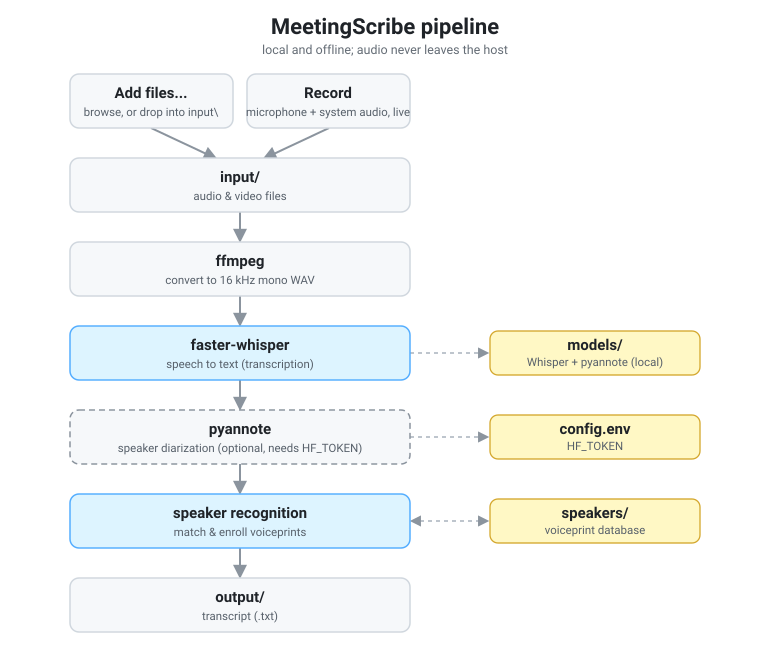
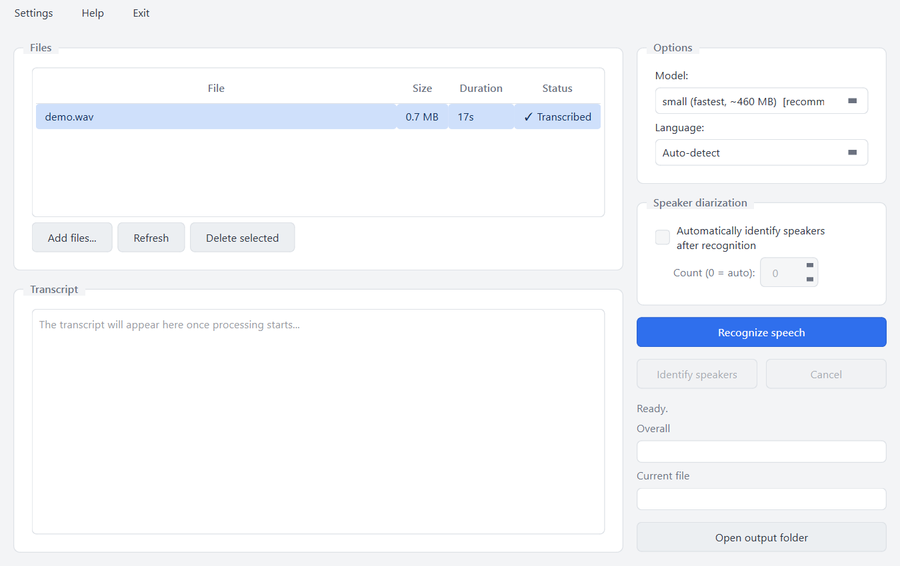

<p align="center">
  
</p>

# MeetingScribe

[](https://en.wikipedia.org/wiki/List_of_Microsoft_Windows_versions)
[](https://github.com/sergeiown/MeetingScribe/blob/main/LICENSE)
[](https://github.com/sergeiown/MeetingScribe/releases/latest)

[](README.md)
[](README.uk.md)

Local speech-to-text with speaker diarization and known-speaker recognition.
Everything runs on your own machine via [faster-whisper](https://github.com/SYSTRAN/faster-whisper)
and [pyannote.audio](https://github.com/pyannote/pyannote-audio) - no cloud APIs,
no audio ever leaves the host.

Built for meeting and conversation recordings, primarily in **Ukrainian**, with
automatic language detection (Whisper is multilingual, so other languages work too).

## How it works

<p align="center">
  
</p>

1. You add audio/video files with **Add files...** (or drop them into the
   `input/` folder) and click **Recognize speech**.
2. faster-whisper transcribes the speech.
3. If enabled (or later, via **Identify speakers**), pyannote `speaker-diarization-3.1`
   splits the audio into speaker turns.
4. Each turn is turned into a voice embedding and matched against a local
   speaker database, so known people get their real names in the transcript.
5. Unrecognized speakers are shown with sample lines; you can name them and
   optionally save their voiceprint for next time.
6. The result is written as plain text to the `output/` folder.

If no HuggingFace token is configured, diarization is unavailable and the tool
falls back to a plain transcript with timestamps.

## Features

- Native desktop GUI (Windows) - no command line needed for everyday use.
- Fully local - runs offline once models are downloaded; no audio uploaded anywhere.
- Speaker diarization (who spoke when) via pyannote `speaker-diarization-3.1`.
- Recognition and speaker identification are separate steps: run both at once,
  or identify speakers later for an already-recognized file, without
  re-running speech recognition.
- Known-speaker recognition against a local, versioned voiceprint database.
- On-the-fly enrollment: name an unknown speaker and save their voiceprint
  (`Name (v1).npy`, `Name (v2).npy`, …), with overwrite / add-version / skip prompts.
- No silent downloads - the app always asks before fetching a model, with the
  recommended choice pre-checked.
- In-app updates: MeetingScribe checks for a newer version on launch and can
  download and install it with one confirmation, no browser required.
- Light/dark theme (follows Windows automatically, or set manually) and an
  English/Ukrainian interface language switch.
- Automatic language detection, optimized for Ukrainian (other languages are
  supported via Whisper's multilingual model).
- CPU or NVIDIA CUDA, auto-detected.
- Skips files already transcribed in `output/` (asks before overwriting), so
  re-running a batch does not redo finished work.
- Plain-text output, easy to read and diff.

## Requirements

What you need yourself:

- **Windows 10/11.**
- **An internet connection** for installation and the first run (to fetch
  dependencies and models).
- **Optional: a [HuggingFace](https://huggingface.co/) account and token** to
  enable speaker diarization. Without it the tool still works as plain
  transcription. See [Configuration](#configuration-huggingface-token).

Everything else is installed automatically by the installer or the app itself,
you do not need to prepare any of it:

- **Python 3.12** and **ffmpeg** (only if not already installed).
- **Python dependencies** (faster-whisper, pyannote.audio, torch, numpy,
  huggingface_hub, PySide6) - installed into a private environment the app
  keeps to itself, never your system Python.
- The **CUDA build of torch** if an NVIDIA GPU is detected (otherwise it runs on
  CPU). Auto-detected, nothing to configure.
- The **models** (see [Models and licenses](#models-and-licenses)).

## Install

1. Download the latest installer from the
   [Releases page](https://github.com/sergeiown/MeetingScribe/releases/latest)
   (`MeetingScribe-Setup-<version>.exe`) and run it.
2. It installs Python and ffmpeg via winget if either is missing, sets up a
   private environment for MeetingScribe (never your system Python), and
   launches the app.
3. On first launch, the app installs its remaining dependencies (with a
   progress window) and, if no recognition model is installed yet, asks
   before downloading one - nothing happens silently, and the recommended
   choice is pre-checked. A small demo recording (`samples/demo.wav`) is
   bundled so there's something to try right away, no recording of your own
   required.

MeetingScribe checks for updates on launch (and via **Help > Check for
updates**); installing one is a single confirmation away.

Prefer to run from source instead? See `setup.bat` and `run_gui.bat` in the
project root, or `packaging/README.md` for building the installer yourself.

## Configuration (HuggingFace token)

Diarization uses gated pyannote models, which require a HuggingFace token with
the model licenses accepted.

1. Get a token at <https://hf.co/settings/tokens>.
2. Paste it into the app's **Settings > Models** tab and click "Save token" -
   this writes it to `config.env` for you. (You can also edit `config.env`
   directly; see `config.env.example`. `HF_TOKEN` can also be set as an
   environment variable, which takes precedence.)
3. Accept the license for each gated pyannote model while logged in to
   HuggingFace:
   - <https://hf.co/pyannote/speaker-diarization-3.1>
   - <https://hf.co/pyannote/segmentation-3.0>
   - <https://hf.co/pyannote/embedding>

`config.env` is git-ignored and must never be committed with a real token.

## Usage

<p align="center">
  <picture>
    <source media="(prefers-color-scheme: dark)" srcset="img/screenshot_dark.png">
    
  </picture>
</p>

1. Launch MeetingScribe from the Start Menu or desktop shortcut (it also opens
   automatically right after installing).
2. Use **Add files...** in the app (simplest), or put files in the `input/`
   folder.
3. Select one or more files in the table, pick a recognition model and language.
4. Click **Recognize speech**. With "Automatically identify speakers after
   recognition" off, it stops after producing a plain transcript - click
   **Identify speakers** whenever you're ready to add speaker labels to an
   already-recognized file, without re-running speech recognition.
5. For unrecognized speakers, name them and optionally save their voiceprint
   for next time.
6. Find the transcript in `output/` (one `.txt` per input file).

Installed models, saved speakers, your HuggingFace token, theme, and interface
language (English/Українська) are all managed from **Settings**.

## Supported input formats

`.webm` `.mp4` `.mkv` `.mov` `.avi` `.m4a` `.mp3` `.wav`

## Recording tip

For the cleanest results, record with [OBS Studio](https://obsproject.com) (free
and open-source). Optimal audio settings:

- **Settings → Audio → Sample Rate:** 44.1 kHz
- **Settings → Audio → Channels:** Mono
- **Settings → Output → Recording Format:** MP4

Mono speech is all the tool needs (it downmixes to 16 kHz mono internally) and it
keeps files small. Stop the recording properly so the file finalizes (an
unfinished recording can be unreadable).

## Output format

Plain text, one block per speaker turn:

```
[Speaker name or Speaker N] mm:ss
spoken text for this turn...

[Another speaker] mm:ss
their spoken text...
```

If diarization is unavailable, the tool falls back to a continuous transcript
with periodic timestamps.

## Models and licenses

No model weights are stored in this repository. They are downloaded through
the app itself (the first-run prompt for the mandatory model, or **Settings >
Models** for the rest) into the local `models/` folder, and **each is covered
by its own license - not by this project's MIT license**. You are responsible
for accepting and complying with the terms of every model you download.

### Speaker diarization & recognition - pyannote (gated)

These require a HuggingFace account and accepting the conditions on each model
page (see [Configuration](#configuration-huggingface-token)):

| Model | Page | Used for |
|---|---|---|
| `pyannote/speaker-diarization-3.1` | <https://hf.co/pyannote/speaker-diarization-3.1> | Diarization pipeline |
| `pyannote/segmentation-3.0` | <https://hf.co/pyannote/segmentation-3.0> | Speech segmentation |
| `pyannote/wespeaker-voxceleb-resnet34-LM` | <https://hf.co/pyannote/wespeaker-voxceleb-resnet34-LM> | Diarization embeddings |
| `pyannote/embedding` | <https://hf.co/pyannote/embedding> | Known-speaker enrollment & matching |

### Speech recognition - Whisper (via faster-whisper)

Public repositories, downloaded under their own terms:

| Model | Page | Notes |
|---|---|---|
| `Systran/faster-whisper-small` | <https://hf.co/Systran/faster-whisper-small> | **Mandatory** - light, fast, multilingual (~460 MB) |
| `mobiuslabsgmbh/faster-whisper-large-v3-turbo` | <https://hf.co/mobiuslabsgmbh/faster-whisper-large-v3-turbo> | **Optional** - higher accuracy (~1.6 GB) |
| `Systran/faster-whisper-large-v3` | <https://hf.co/Systran/faster-whisper-large-v3> | **Optional** - best accuracy (~3 GB, slower) |

The underlying Whisper model is by OpenAI
(<https://github.com/openai/whisper>), released under the MIT license.

**Mandatory set:** the four pyannote models plus Whisper `small`.
**Optional set:** Whisper `large-v3-turbo` and `large-v3`.

## Built with

This tool stands on these open-source projects (their own licenses apply):

| Library | Project | License |
|---|---|---|
| faster-whisper | <https://github.com/SYSTRAN/faster-whisper> | MIT |
| pyannote.audio | <https://github.com/pyannote/pyannote-audio> | MIT |
| PySide6 (Qt for Python) | <https://www.qt.io/qt-for-python> | LGPL-3.0 |
| PyTorch | <https://github.com/pytorch/pytorch> | BSD-3-Clause |
| NumPy | <https://github.com/numpy/numpy> | BSD-3-Clause |
| huggingface_hub | <https://github.com/huggingface/huggingface_hub> | Apache-2.0 |
| FFmpeg | <https://ffmpeg.org/> | LGPL-2.1+/GPL |

## License

This project's source code is released under the [MIT License](LICENSE). Model
weights are **not** covered by this license - see "Models and licenses" above.
