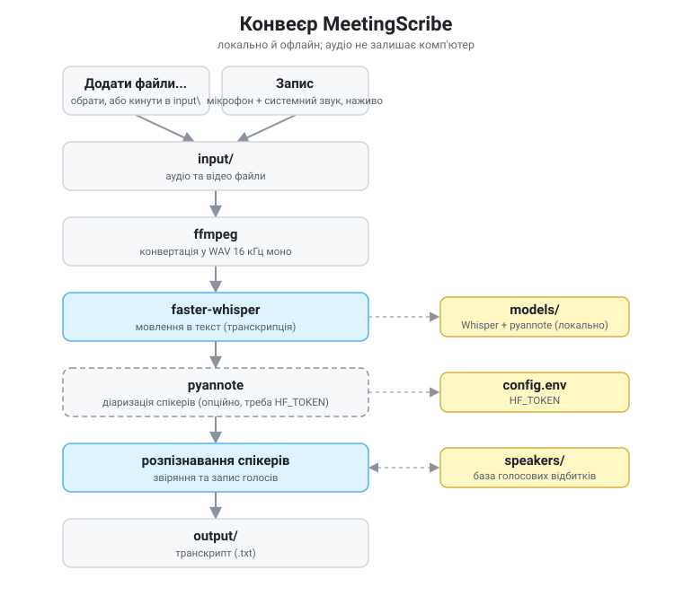
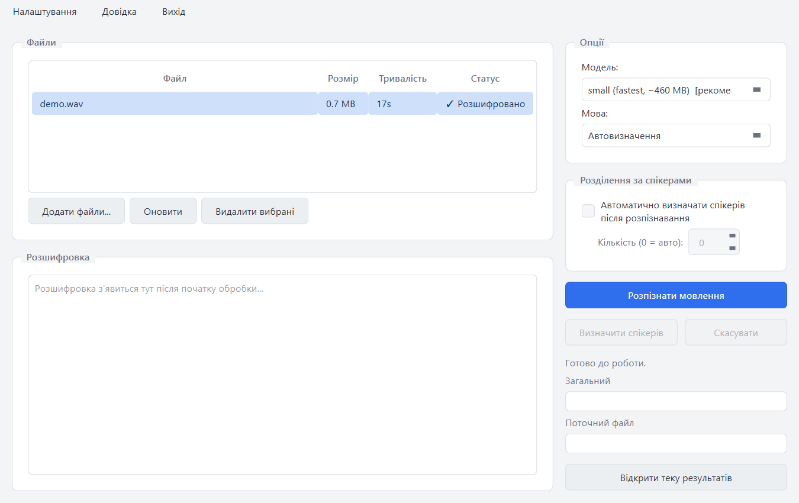

<p align="center">
  
</p>

# MeetingScribe

[](https://en.wikipedia.org/wiki/List_of_Microsoft_Windows_versions)
[](https://github.com/sergeiown/MeetingScribe/blob/main/LICENSE)
[](https://github.com/sergeiown/MeetingScribe/releases/latest)

[](README.md)
[](README.uk.md)

Локальне перетворення мовлення в текст із діаризацією спікерів і розпізнаванням
відомих голосів. Усе працює на твоїй машині через
[faster-whisper](https://github.com/SYSTRAN/faster-whisper) та
[pyannote.audio](https://github.com/pyannote/pyannote-audio) - жодних хмарних
API, аудіо ніколи не залишає комп'ютер.

Створено для записів зустрічей і розмов, насамперед **українською**, з
автоматичним визначенням мови (Whisper мультимовний, тож інші мови теж працюють).

## Як це працює

<p align="center">
  
</p>

1. Додаєш аудіо/відео файли кнопкою **Додати файли...** (або кладеш їх у папку
   `input/`) і натискаєш **Розпізнати мовлення**.
2. faster-whisper транскрибує мовлення.
3. Якщо увімкнено (або пізніше, через **Визначити спікерів**), pyannote
   `speaker-diarization-3.1` розділяє аудіо на репліки спікерів.
4. Кожна репліка перетворюється на голосовий ембединг і звіряється з локальною
   базою спікерів, тож відомі люди отримують свої справжні імена в транскрипті.
5. Нерозпізнані спікери показуються зі зразками реплік; їх можна назвати й за
   бажанням зберегти голосовий відбиток на майбутнє.
6. Результат записується як звичайний текст у папку `output/`.

Якщо токен HuggingFace не налаштовано, діаризація недоступна, і інструмент
повертається до простого транскрипту з часовими мітками.

## Можливості

- Нативний десктопний GUI (Windows) - командний рядок не потрібен для щоденного використання.
- Повністю локально - працює офлайн після завантаження моделей; аудіо нікуди не
  надсилається.
- Діаризація спікерів (хто коли говорив) через pyannote `speaker-diarization-3.1`.
- Розпізнавання мовлення та визначення спікерів - окремі кроки: роби обидва одразу,
  або визнач спікерів пізніше для вже розпізнаного файлу, без повторного розпізнавання.
- Розпізнавання відомих спікерів за локальною версіонованою базою голосових
  відбитків.
- Запис «на льоту»: назви невідомого спікера й збережи його відбиток
  (`Name (v1).npy`, `Name (v2).npy`, …) з вибором перезаписати / додати версію /
  пропустити.
- Жодних тихих завантажень - застосунок завжди питає перед завантаженням моделі,
  з попередньо позначеним рекомендованим варіантом.
- Оновлення прямо в застосунку: MeetingScribe перевіряє нову версію при
  запуску й може завантажити та встановити її одним підтвердженням, без браузера.
- Світла/темна тема (автоматично слідує за Windows, або вручну) та перемикач
  мови інтерфейсу English/Українська.
- Автоматичне визначення мови, оптимізоване для української (інші мови
  підтримуються мультимовною моделлю Whisper).
- CPU або NVIDIA CUDA, автовизначення.
- Пропускає файли, вже транскрибовані в `output/` (питає перед перезаписом), тож
  повторний запуск пакету не переробляє готове.
- Вивід у простому тексті - зручно читати й порівнювати (diff).

## Вимоги

Що потрібно від тебе:

- **Windows 10/11.**
- **Інтернет** для встановлення й першого запуску (щоб завантажити залежності
  та моделі).
- **Опційно: акаунт [HuggingFace](https://huggingface.co/) і токен**, щоб
  увімкнути діаризацію спікерів. Без нього інструмент усе одно працює як звичайна
  транскрипція. Див. [Налаштування](#налаштування-токен-huggingface).

Усе інше встановлює сам інсталятор або застосунок, готувати нічого не треба:

- **Python 3.12** і **ffmpeg** (лише якщо ще не встановлені).
- **Python-залежності** (faster-whisper, pyannote.audio, torch, numpy,
  huggingface_hub, PySide6) - у приватному середовищі, яке застосунок тримає
  окремо від твого системного Python.
- **CUDA-збірку torch**, якщо виявлено відеокарту NVIDIA (інакше працює на CPU).
  Автовизначення, нічого налаштовувати не треба.
- Самі **моделі** (див. [Моделі та ліцензії](#моделі-та-ліцензії)).

## Встановлення

1. Завантаж останній інсталятор зі
   [сторінки релізів](https://github.com/sergeiown/MeetingScribe/releases/latest)
   (`MeetingScribe-Setup-<версія>.exe`) і запусти його.
2. Він встановить Python і ffmpeg через winget, якщо чогось із них бракує,
   налаштує приватне середовище для MeetingScribe (окремо від системного
   Python) і запустить застосунок.
3. При першому запуску застосунок довстановить решту залежностей (з вікном
   прогресу) і, якщо модель розпізнавання ще не встановлена, запитає перед
   завантаженням - нічого не відбувається тихо, і рекомендований варіант вже
   позначено. У комплекті є короткий демо-запис (`samples/demo.wav`), тож є
   що спробувати одразу, без запису чогось свого.

MeetingScribe перевіряє оновлення при запуску (а також через **Довідка >
Перевірити оновлення**) - встановити нову версію можна одним підтвердженням.

Хочеш запускати з вихідного коду? Дивись `setup.bat` і `run_gui.bat` у корені
проєкту.

## Налаштування (токен HuggingFace)

Діаризація використовує закриті (gated) моделі pyannote, які потребують токена
HuggingFace із прийнятими ліцензіями.

1. Отримай токен на <https://hf.co/settings/tokens>.
2. Встав його на вкладці **Settings > Models** застосунку й натисни "Save
   token" - це запише його в `config.env` за тебе. (Можна й відредагувати
   `config.env` вручну - див. `config.env.example`. `HF_TOKEN` можна також
   задати змінною оточення - вона має пріоритет.)
3. Прийми ліцензію для кожної закритої моделі pyannote, увійшовши в HuggingFace:
   - <https://hf.co/pyannote/speaker-diarization-3.1>
   - <https://hf.co/pyannote/segmentation-3.0>
   - <https://hf.co/pyannote/embedding>

`config.env` додано до `.gitignore` і ніколи не має комітитися зі справжнім
токеном.

## Використання

<p align="center">
  <picture>
    <source media="(prefers-color-scheme: dark)" srcset="img/screenshot_dark_ua.png">
    
  </picture>
</p>

1. Запусти MeetingScribe з меню Пуск чи ярлика на робочому столі (він також
   відкривається сам одразу після встановлення).
2. Скористайся **Додати файли...** в застосунку (простіше) або поклади файли
   в папку `input/`.
3. Вибери один або кілька файлів у таблиці, обери модель розпізнавання й мову.
4. Натисни **Розпізнати мовлення**. Якщо "Автоматично визначати спікерів після
   розпізнавання" вимкнено, процес зупиниться після звичайного транскрипту -
   натисни **Визначити спікерів**, коли будеш готовий додати мітки спікерів до
   вже розпізнаного файлу, без повторного розпізнавання.
5. Для нерозпізнаних спікерів за бажанням введи ім'я й збережи голосовий відбиток.
6. Транскрипт зʼявиться в `output/` (один `.txt` на кожен вхідний файл).

Встановлені моделі, збережені спікери, токен HuggingFace, тема та мова
інтерфейсу (English/Українська) керуються з **Settings**.

## Підтримувані вхідні формати

`.webm` `.mp4` `.mkv` `.mov` `.avi` `.m4a` `.mp3` `.wav`

## Порада щодо запису

Для найкращого результату записуй через [OBS Studio](https://obsproject.com)
(безкоштовний, з відкритим кодом). Оптимальні налаштування звуку:

- **Settings → Audio → Sample Rate:** 44.1 кГц
- **Settings → Audio → Channels:** Mono (моно)
- **Settings → Output → Recording Format:** MP4

Для транскрипції достатньо моно-звуку (інструмент усе одно зводить у 16 кГц моно),
і файли виходять меншими. Коректно зупиняй запис, щоб файл фіналізувався
(недописаний запис може не читатись).

## Формат виводу

Звичайний текст, один блок на репліку спікера:

```
[Імʼя спікера або Speaker N] mm:ss
текст цієї репліки...

[Інший спікер] mm:ss
його текст...
```

Якщо діаризація недоступна, інструмент повертається до суцільного транскрипту з
періодичними часовими мітками.

## Моделі та ліцензії

У цьому репозиторії не зберігаються ваги моделей. Вони завантажуються через сам
застосунок (запит при першому запуску для обовʼязкової моделі, або **Settings >
Models** для решти) у локальну папку `models/`, і **кожна модель покрита
власною ліцензією - не MIT-ліцензією цього проєкту**. Ти відповідаєш за
прийняття й дотримання умов кожної завантаженої моделі.

### Діаризація та розпізнавання спікерів - pyannote (gated)

Потребують акаунта HuggingFace і прийняття умов на сторінці кожної моделі
(див. [Налаштування](#налаштування-токен-huggingface)):

| Модель | Сторінка | Призначення |
|---|---|---|
| `pyannote/speaker-diarization-3.1` | <https://hf.co/pyannote/speaker-diarization-3.1> | Конвеєр діаризації |
| `pyannote/segmentation-3.0` | <https://hf.co/pyannote/segmentation-3.0> | Сегментація мовлення |
| `pyannote/wespeaker-voxceleb-resnet34-LM` | <https://hf.co/pyannote/wespeaker-voxceleb-resnet34-LM> | Ембединги для діаризації |
| `pyannote/embedding` | <https://hf.co/pyannote/embedding> | Запис і звіряння відомих спікерів |

### Розпізнавання мовлення - Whisper (через faster-whisper)

Публічні репозиторії, завантажуються на власних умовах:

| Модель | Сторінка | Примітки |
|---|---|---|
| `Systran/faster-whisper-small` | <https://hf.co/Systran/faster-whisper-small> | **Обовʼязкова** - легка, швидка, мультимовна (~460 МБ) |
| `mobiuslabsgmbh/faster-whisper-large-v3-turbo` | <https://hf.co/mobiuslabsgmbh/faster-whisper-large-v3-turbo> | **Опційна** - вища точність (~1.6 ГБ) |
| `Systran/faster-whisper-large-v3` | <https://hf.co/Systran/faster-whisper-large-v3> | **Опційна** - найвища точність (~3 ГБ, повільніша) |

Базова модель Whisper - від OpenAI (<https://github.com/openai/whisper>),
випущена під ліцензією MIT.

**Обовʼязковий набір:** чотири моделі pyannote плюс Whisper `small`.
**Опційний набір:** Whisper `large-v3-turbo` та `large-v3`.

## Зібрано на основі

Цей інструмент спирається на такі опенсорс-проєкти (діють їхні власні ліцензії):

| Бібліотека | Проєкт | Ліцензія |
|---|---|---|
| faster-whisper | <https://github.com/SYSTRAN/faster-whisper> | MIT |
| pyannote.audio | <https://github.com/pyannote/pyannote-audio> | MIT |
| PySide6 (Qt for Python) | <https://www.qt.io/qt-for-python> | LGPL-3.0 |
| PyTorch | <https://github.com/pytorch/pytorch> | BSD-3-Clause |
| NumPy | <https://github.com/numpy/numpy> | BSD-3-Clause |
| huggingface_hub | <https://github.com/huggingface/huggingface_hub> | Apache-2.0 |
| FFmpeg | <https://ffmpeg.org/> | LGPL-2.1+/GPL |

## Ліцензія

Вихідний код цього проєкту випущено під [ліцензією MIT](LICENSE). Ваги моделей
**не** покриваються цією ліцензією - див. «Моделі та ліцензії» вище.

---

**Примітка. Якщо ви в Україні - перевірте, чи стежите ви за тривогами у вашому регіоні. [Alert Server](https://github.com/sergeiown/Alert_Server) - мій застосунок для Windows з відкритим кодом, без жодної реклами чи прихованих умов, що показує сповіщення про повітряну тривогу, live-мапу загроз і лінію фронту для обраних вами регіонів. Будьте в безпеці.**
